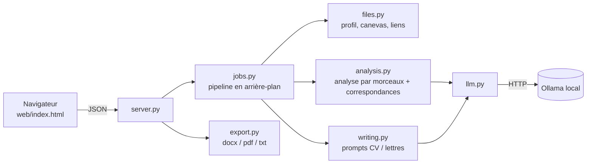

# MELcv

Assistant **100 % local** qui adapte un CV ou une lettre (de motivation ou de présentation) à une offre d'emploi.
Aucune donnée n'est envoyée à un service externe : l'IA tourne sur ton ordinateur grâce à [Ollama](https://ollama.com).

## Fonctionnalités

- Analyse d'offres **volumineuses**, en toute langue, par morceaux (poste, missions, exigences, mots-clés, langue).
- Comparaison offre / profil : les exigences **sans preuve** dans ton profil sont signalées, jamais inventées.
- Rédaction **en français ou en anglais** (automatique selon l'offre, ou imposée), selon un canevas de lettre fourni.
- Export **Word (.docx)**, **PDF** et texte ; le PDF est identique au Word si LibreOffice est installé.
- Lecture d'une offre à partir d'un **lien** collé dans la page.
- Interface web locale (aucun framework, uniquement la bibliothèque standard côté serveur).

## Architecture



| Module | Rôle |
|---|---|
| `config.py` | chemins, réglages |
| `files.py` | lecture .txt/.docx/.pdf, pages web |
| `llm.py` | client Ollama |
| `analysis.py` | découpage, extraction JSON, fusion, correspondances |
| `writing.py` | construction des prompts de rédaction |
| `jobs.py` | pipeline complet exécuté en tâche de fond |
| `export.py` | rendu .docx (python-docx) et .pdf (LibreOffice ou ReportLab) |
| `server.py` | serveur HTTP local (127.0.0.1) et API |

## Installation

```bash
git clone <ton-depot> && cd MELcv
python -m venv .venv
.venv\Scripts\activate          # Windows   (Mac/Linux : source .venv/bin/activate)
pip install -e ".[dev]"
ollama pull qwen2.5:7b           # ou qwen2.5:14b pour de meilleurs textes
```

## Utilisation

```bash
melcv            # ou : python -m melcv
```

1. Onglet **Mon profil** : remplis-le une fois (modèle dans `data/profil.example.txt`).
2. Mets ton canevas de lettre dans `modeles/` et tes listes de vocabulaire dans `references/` (facultatif).
3. Onglet **Candidature** : colle l'offre, choisis le document et la langue, puis **Générer**.
4. Relis, corrige, puis exporte en Word ou PDF (copie dans `sorties/`).

## Développement (VS Code)

Ouvre le dossier dans VS Code et accepte les extensions recommandées.
`F5` lance l'application, la tâche **Tests** lance la suite de tests.

```bash
pytest -q
ruff check . && ruff format .
```

## Confidentialité

`.gitignore` exclut ton profil, tes réglages, les documents générés et les documents d'école
(`modeles/`, `references/`). Vérifie avec `git status` avant de publier.

## Limites connues

- La qualité des textes dépend du modèle local choisi : relis toujours avant d'envoyer.
- Pas de recherche web libre : seuls les liens collés sont lus.

## Licence

MIT
